# CI-AF036-001 Blended Wing Body System Specification
## Advanced Aerodynamic Architecture within AMEDEO-P DT-OPTIM Framework

**Configuration Item**: CI-AF036-001  
**System**: System-036-BWB  
**Architecture**: Blended Wing Body (BWB)  
**Category**: AMPEL-C (Advanced Multi-Purpose Engineering Level C)  
**Domain**: AIR  
**Segment**: Airframes & Structures (A)  
**Version**: 1.0  
**Date**: 2025-08-25  
**Classification**: CONTROLLED - Advanced Technology

---

## EXECUTIVE SUMMARY

CI-AF036-001 represents the Blended Wing Body (BWB) architecture within the AMEDEO-P DT-OPTIM framework's AIR domain. As system 036 of 200 in the Airframes segment, this configuration item embodies next-generation aerodynamic efficiency with up to 30% improved fuel efficiency compared to conventional designs. The BWB architecture integrates fuselage and wing into a single lifting surface, requiring revolutionary approaches to structural design, systems integration, and passenger accommodation.

### Key Differentiators from Conventional (CI-AF001-001)
- **Integrated Lifting Body**: Entire aircraft generates lift
- **30% Fuel Efficiency Gain**: Superior L/D ratio
- **50% Noise Reduction**: Engines shielded by airframe
- **2.5x Cargo Volume**: Efficient internal volume utilization
- **Novel Control Surfaces**: Distributed control architecture

---

## 1. SYSTEM ARCHITECTURE OVERVIEW

### 1.1 BWB Configuration Breakdown


### 1.2 AMPEL-C Category Definition

**AMPEL-C (Advanced Multi-Purpose Engineering Level C)**

```yaml
ampel_classification:
  A: "Advanced" - Beyond current TRL-9 systems
  M: "Multi-Purpose" - Passenger, cargo, military variants
  P: "Platform" - Base architecture for derivatives
  E: "Engineering" - Requires new engineering methods
  L: "Level" - Certification complexity tier
  C: "Category C" - Highest complexity/innovation tier
  
  characteristics:
    innovation_level: "Revolutionary"
    certification_path: "Special Conditions Required"
    development_risk: "High"
    market_disruption: "Significant"
    technology_readiness: "TRL 4-6"
```

### 1.3 Comparison with Conventional Architecture

| Aspect | CI-AF001-001 (Conventional) | CI-AF036-001 (BWB) | Improvement |
|--------|------------------------------|--------------------|--------------| 
| L/D Ratio | 18-20 | 25-27 | +35% |
| Fuel Efficiency | Baseline | -30% | 30% Better |
| Passenger Capacity | 150-400 | 400-800 | +100% |
| Cargo Volume | 175 m³ | 440 m³ | +151% |
| Noise Level | 85 dB | 65 dB | -20 dB |
| Structural Weight | 100% | 85% | -15% |
| Manufacturing Complexity | Standard | High | +200% |

---

## 2. DETAILED SYSTEM REQUIREMENTS

### 2.1 Structural Requirements (BWB-Specific)

#### BWB-STR-001: Integrated Pressure Vessel
- **ID**: CI-AF036-001-STR-001
- **Priority**: Critical
- **Description**: Structure shall maintain pressurization across non-circular cross-sections
- **Unique Challenges**:
  - Non-cylindrical pressure vessel
  - Distributed hoop stress management
  - Multi-bubble pressure compartments
- **Design Solution**:
  - Tension membrane structures
  - Y-bracket reinforcements
  - Composite sandwich construction
- **Verification Method**: FEA, Pressure testing to 18.75 psi
- **DAL**: A
- **Traced To**: BWB Patent Portfolio, NASA X-48 Data

#### BWB-STR-002: Spanwise Load Distribution
- **ID**: CI-AF036-001-STR-002
- **Priority**: Critical
- **Description**: Structure shall distribute loads across 80m integrated wing-body
- **Load Cases**:
  - Limit Load: +2.5g/-1.0g
  - Ultimate Load: +3.75g/-1.5g
  - Gust Load: FAR 25.341 equivalence
- **Material Requirements**:
  - CFRP primary structure (60%)
  - Al-Li alloy secondary (25%)
  - Titanium interfaces (15%)
- **Verification Method**: Static test, Flight loads survey
- **DAL**: A

#### BWB-STR-003: Cabin Floor Integration
- **ID**: CI-AF036-001-STR-003
- **Priority**: High
- **Description**: Multi-deck cabin floor supporting 800 passengers
- **Configuration**:
  - Upper deck: 400 passengers (2-3-2 config)
  - Lower deck: 400 passengers (3-3-3 config)
  - Cargo bay: 440 m³ continuous
- **Emergency Egress**: 20 exits, 90-second evacuation
- **Verification Method**: Evacuation demonstration
- **DAL**: A

### 2.2 Aerodynamic Requirements

#### BWB-AERO-001: Laminar Flow Maintenance
- **ID**: CI-AF036-001-AERO-001
- **Priority**: High
- **Description**: Maintain laminar flow over 40% of wetted area
- **Performance Targets**:
  - Transition location: 40% chord minimum
  - Surface roughness: Ra < 0.3 μm
  - Waviness: < 0.1 mm over 100 mm
- **Technologies**:
  - Hybrid Laminar Flow Control (HLFC)
  - Plasma actuators for transition delay
  - Smart skin with embedded sensors
- **Verification Method**: Flight test with IR imaging
- **DAL**: B

#### BWB-AERO-002: Vortex Control
- **ID**: CI-AF036-001-AERO-002
- **Priority**: Critical
- **Description**: Manage complex vortex systems at wing-body junction
- **Control Features**:
  - Vortex generators (200 units)
  - Active flow control slots
  - Synthetic jet actuators
- **Performance Impact**: Prevent 5% efficiency loss
- **Verification Method**: Wind tunnel, CFD validation
- **DAL**: B

### 2.3 Control System Requirements

#### BWB-CTRL-001: Distributed Control Architecture
- **ID**: CI-AF036-001-CTRL-001
- **Priority**: Critical
- **Description**: Coordinate 20+ independent control surfaces
- **Control Surfaces**:
  - Elevons: 8 segments
  - Spoilers: 12 segments
  - Winglets: 2 all-moving
  - Trim tabs: 6 distributed
  - Canards: 2 (optional)
- **Control Laws**:
  - Adaptive neural network based
  - Fault-tolerant with 3x redundancy
  - Morphing optimization real-time
- **Response Time**: < 50 ms
- **Verification Method**: HIL simulation, Flight test
- **DAL**: A

#### BWB-CTRL-002: Pitch Control Authority
- **ID**: CI-AF036-001-CTRL-002
- **Priority**: Critical
- **Description**: Maintain pitch control without conventional tail
- **Requirements**:
  - Pitch rate: ±5°/sec minimum
  - Authority: -10° to +25° AoA
  - CG range: 15% to 35% MAC
- **Unique Solutions**:
  - Thrust vectoring integration
  - Active CG management
  - Distributed elevon coordination
- **Verification Method**: Flight test full envelope
- **DAL**: A

### 2.4 Propulsion Integration Requirements

#### BWB-PROP-001: Boundary Layer Ingestion (BLI)
- **ID**: CI-AF036-001-PROP-001
- **Priority**: High
- **Description**: Engines shall ingest boundary layer for efficiency
- **Configuration**:
  - Engine position: Aft fuselage embedded
  - BLI percentage: 40% of inlet flow
  - Efficiency gain: 8-10% TSFC improvement
- **Challenges**:
  - Inlet distortion management
  - Fan blade stress cycles
  - Acoustic treatment
- **Verification Method**: Ground test, Flight validation
- **DAL**: B

#### BWB-PROP-002: Noise Shielding
- **ID**: CI-AF036-001-PROP-002
- **Priority**: High
- **Description**: Airframe shall shield engine noise
- **Performance Targets**:
  - Forward radiation: -15 dB
  - Sideline noise: -10 dB
  - Community noise: Stage 5 -20 dB margin
- **Design Features**:
  - Engine location above wing
  - Acoustic liners in nacelles
  - Chevron nozzles
- **Verification Method**: Acoustic testing
- **DAL**: C

---

## 3. DIGITAL TWIN IMPLEMENTATION

### 3.1 BWB-Specific Digital Twin Architecture

```mermaid
graph TD
    subgraph "Physical BWB System"
        PS[10,000+ Sensors<br/>Distributed array]
        AS[Aerodynamic State<br/>Pressure, flow]
        SS[Structural State<br/>Strain, vibration]
        CS[Control State<br/>Surface positions]
    end
    
    subgraph "BWB Digital Twin"
        DT[High-Fidelity Model<br/>10⁹ DoF]
        CFD[Real-time CFD<br/>Adaptive mesh]
        FEA[Dynamic FEA<br/>Nonlinear analysis]
        ML[ML Predictions<br/>100+ models]
    end
    
    subgraph "Unique BWB Analytics"
        VFM[Vortex Flow Modeling]
        PLO[Passenger Load Optimization]
        MCA[Morphing Control Adaptation]
        BLI[BLI Performance Tracking]
    end
    
    PS --> DT
    AS --> CFD
    SS --> FEA
    CS --> ML
    
    DT --> VFM
    CFD --> PLO
    FEA --> MCA
    ML --> BLI
```



### 3.2 BWB Digital Twin Requirements

#### DT-BWB-001: Structural Health Monitoring
- **Sensor Density**: 50 sensors/m² critical areas
- **Update Rate**: 1000 Hz structural, 100 Hz thermal
- **Fidelity Target**: 99% correlation with test data
- **Predictive Horizon**: 500 flight hours
- **Special Focus**: Non-circular pressure vessel fatigue

#### DT-BWB-002: Aerodynamic Performance Tracking
- **Parameters Monitored**: 
  - Laminar-turbulent transition line
  - Vortex strength and position
  - BLI effectiveness
  - Control surface effectiveness
- **Data Rate**: 10 GB/flight hour
- **Model Update**: Every 10 flights
- **Accuracy Requirement**: ±2% drag prediction

#### DT-BWB-003: Passenger Experience Optimization
- **Metrics Tracked**:
  - Cabin pressure distribution
  - Noise levels (80 zones)
  - Vibration comfort (ISO 2631)
  - Emergency egress times
- **Optimization Targets**:
  - Minimize motion sickness index
  - Equalize pressure changes
  - Optimize boarding/deplaning
- **Update Frequency**: Real-time during flight

---

## 4. 11-PHASE LIFECYCLE IMPLEMENTATION

### 4.1 Phase-Specific Considerations for BWB


### 4.2 Lifecycle Phase Details

#### Phase 01: REQUIREMENTS (BWB-Specific)
- **Duration**: 18 months (vs 12 for conventional)
- **Special Activities**:
  - Regulatory engagement for Special Conditions
  - Market acceptance studies
  - Infrastructure compatibility assessment
- **Key Deliverables**:
  - BWB-specific certification basis
  - Passenger acceptance criteria
  - Airport compatibility requirements
- **Status**: ✅ Complete

#### Phase 02: DESIGN
- **Duration**: 24 months
- **Unique Challenges**:
  - Multi-bubble pressure vessel design
  - Distributed systems architecture
  - Passenger arrangement optimization
- **Tools Required**:
  - Advanced CFD (LES capable)
  - Nonlinear FEA
  - Multidisciplinary optimization
- **Status**: 🔄 In Progress (65%)

#### Phase 03: BUILDING-PROTOTYPING
- **Approach**: Scaled demonstrators
- **Prototypes Planned**:
  - 1:50 scale wind tunnel model
  - 1:10 scale flight demonstrator
  - Full-scale cabin mockup
  - Structural test articles
- **Timeline**: 36 months
- **Status**: 📅 Planned Q2 2025

#### Phase 04: EXECUTABLES-PACKAGES
- **Digital-First Approach**:
  - Complete virtual aircraft before physical
  - 10⁹ element CFD models
  - Real-time pilot-in-loop simulation
  - VR passenger experience validation
- **Computational Requirements**:
  - 100,000 CPU hours for certification data
  - 1 PB storage for simulation results
- **Status**: 📅 Planned Q4 2025

#### Phase 05: VERIFICATION-VALIDATION
- **Extended Test Program**:
  - 5,000 hours wind tunnel
  - 2,000 hours flight test
  - 100,000 hours structural testing
- **Special Tests**:
  - Cabin evacuation demonstrations
  - BLI propulsion validation
  - Laminar flow verification
- **Status**: 📅 Planned 2026

#### Phase 06: INTEGRATION-QUALIFICATION
- **System Complexity**: 
  - 20+ control surfaces coordination
  - 10,000+ sensor integration
  - Triple-redundant flight control
- **Qualification Approach**:
  - Progressive integration
  - Iron bird testing
  - System-of-systems validation
- **Status**: 📅 Planned 2027

#### Phase 07: CERTIFICATION-SECURITY
- **Regulatory Challenges**:
  - New Part 25 Special Conditions
  - ETOPS from entry-into-service
  - Cybersecurity for distributed systems
- **Certification Plan**:
  - Joint EASA/FAA program
  - Phased type certification
  - Operational approval parallel path
- **Status**: 📅 Planned 2028

#### Phase 08: PRODUCTION-SCALE
- **Manufacturing Innovation**:
  - 40m x 80m composite cure tools
  - Automated fiber placement
  - Digital twin birth certificate
- **Production Rate Target**:
  - Year 1: 2 aircraft
  - Year 5: 2 per month
  - Mature: 4 per month
- **Status**: 📅 Planned 2029

#### Phase 09: OPS-SERVICES
- **Operational Considerations**:
  - New pilot type rating required
  - Ground handling procedures
  - Passenger loading strategies
- **Support Infrastructure**:
  - Specialized GSE
  - Maintenance training centers
  - Digital service platform
- **Status**: 📅 Planned 2030

#### Phase 10: MRO
- **Maintenance Philosophy**:
  - Condition-based maintenance
  - Digital twin predictive
  - Modular component exchange
- **Special Requirements**:
  - Composite repair capability
  - BLI engine maintenance
  - Distributed system diagnostics
- **Status**: 📅 Planned 2030+

#### Phase 11: SUSTAINMENT-RECYCLE-EOL
- **Design for Sustainability**:
  - 95% recyclable materials
  - Composite reclamation process
  - Battery/electronic recovery
- **Service Life**: 
  - Design: 60,000 cycles
  - Calendar: 40 years
  - Extensions: Digital twin based
- **Status**: 📅 Planned 2070

---

## 5. INTEGRATION WITH AMEDEO-P FRAMEWORK

### 5.1 Cross-System Dependencies


### 5.2 Data Exchange Interfaces

| Interface | System | Data Type | Rate | Protocol |
|-----------|--------|-----------|------|----------|
| Structural Health | CI-AM010 | Strain, vibration | 1 kHz | ARINC 664 |
| Flight Control | CI-AD020 | Commands, feedback | 100 Hz | MIL-STD-1553B |
| Propulsion | CI-AP015 | BLI parameters | 10 Hz | AFDX |
| Cabin | CI-AE025 | Environment | 1 Hz | CAN |
| Digital Twin | CI-XD010 | All parameters | Variable | gRPC/MQTT |

---

## 6. TECHNOLOGY ENABLERS

### 6.1 Advanced Technologies Required

```yaml
enabling_technologies:
  materials:
    - carbon_nanotubes: "Structural reinforcement"
    - shape_memory_alloys: "Morphing surfaces"
    - self_healing_composites: "Damage tolerance"
    - metamaterials: "Acoustic treatment"
    
  manufacturing:
    - automated_fiber_placement: "Large composite structures"
    - additive_manufacturing: "Complex geometries"
    - co_curing_processes: "Integrated structures"
    - digital_thread: "Traceability"
    
  systems:
    - distributed_electric: "Control surfaces"
    - fiber_optic_sensing: "Health monitoring"
    - ai_flight_control: "Optimization"
    - quantum_computing: "Design optimization"
    
  operations:
    - augmented_reality: "Maintenance"
    - predictive_analytics: "Scheduling"
    - digital_twin: "Performance tracking"
    - blockchain: "Parts traceability"
```

### 6.2 Research & Development Requirements

| Technology Area | TRL Current | TRL Target | Timeline | Investment |
|----------------|-------------|------------|----------|------------|
| Laminar Flow Control | 6 | 9 | 2027 | $50M |
| BLI Propulsion | 5 | 9 | 2028 | $200M |
| Morphing Surfaces | 4 | 8 | 2029 | $75M |
| AI Flight Control | 5 | 9 | 2027 | $100M |
| Composite Pressure Vessel | 7 | 9 | 2026 | $150M |

---

## 7. RISK ASSESSMENT

### 7.1 BWB-Specific Risks


### 7.2 Risk Mitigation Plan

| Risk | Probability | Impact | Mitigation | Contingency |
|------|------------|--------|------------|-------------|
| Regulatory Approval Delay | High | Critical | Early engagement, precedent research | Phased certification |
| Passenger Acceptance | Medium | High | Cabin mockups, VR experience | Interior design options |
| Manufacturing Complexity | High | High | Automation investment | Production learning curve |
| Airport Infrastructure | Medium | Medium | Compatibility studies | Interim solutions |
| Technology Gaps | High | High | R&D acceleration | Alternative technologies |

---

## 8. PERFORMANCE METRICS

### 8.1 Key Performance Indicators

```yaml
operational_kpis:
  efficiency:
    fuel_burn: "-30% vs conventional"
    l_d_ratio: "27:1"
    empty_weight_fraction: "0.42"
    
  capacity:
    passengers: "800 (dual class)"
    cargo_volume: "440 m³"
    range: "8,000 nm"
    
  environmental:
    noise: "Stage 5 -20 dB"
    emissions: "50% reduction"
    contrails: "Reduced formation"
    
  economics:
    doc: "-25% vs conventional"
    casm: "$0.035/seat-mile"
    utilization: "14 hrs/day"
```

### 8.2 Validation Metrics

| Metric | Target | Method | Frequency | Status |
|--------|--------|--------|-----------|--------|
| Drag Coefficient | CD = 0.015 | Wind tunnel/CFD | Continuous | Validating |
| Structural Weight | -15% vs baseline | FEA/Testing | Milestone | In Progress |
| Noise Level | 65 dB flyover | Acoustic testing | Certification | Planned |
| Fuel Efficiency | -30% | Flight test | Certification | Planned |
| Digital Twin Accuracy | 98% | Correlation | Continuous | Developing |

---

## 9. SUSTAINABILITY & ENVIRONMENTAL IMPACT

### 9.1 Environmental Benefits


### 9.2 Sustainability Features

- **Design for Environment**:
  - 95% recyclable materials
  - Zero hazardous materials
  - Reduced part count (-40%)
  - Modular replacement strategy

- **Operational Efficiency**:
  - 30% fuel reduction
  - 50% NOx reduction
  - 20 dB noise reduction
  - Contrail mitigation design

- **End-of-Life**:
  - Composite recycling process
  - Metal reclamation >98%
  - Battery/electronic recovery
  - Zero landfill target

---

## 10. MARKET & BUSINESS CASE

### 10.1 Market Positioning

```yaml
market_analysis:
  target_segments:
    - ultra_long_haul: "8,000+ nm routes"
    - high_density: "500+ passenger routes"
    - freight_variant: "Cargo optimization"
    - military: "Strategic transport"
    
  competitive_advantages:
    - operating_cost: "-25% vs A380/747"
    - passenger_appeal: "Revolutionary experience"
    - environmental: "Industry leading"
    - versatility: "Passenger/cargo flex"
    
  market_size:
    - addressable: "2,000 aircraft over 20 years"
    - launch_customers: "5 identified"
    - revenue_potential: "$600B"
```

### 10.2 Business Case Summary

| Parameter | Value | Notes |
|-----------|-------|-------|
| Development Cost | $15B | Including certification |
| Unit Cost | $450M | At 100 units |
| Break-even | 250 units | ~10 years |
| ROI | 18% | 20-year horizon |
| Market Share Target | 15% | Ultra-long-haul segment |

---

## 11. CONCLUSION & NEXT STEPS

### 11.1 Summary

CI-AF036-001 represents a revolutionary advancement in aircraft architecture within the AMEDEO-P framework. The Blended Wing Body configuration offers:

- **30% fuel efficiency improvement**
- **50% noise reduction**
- **2.5x cargo capacity**
- **Revolutionary passenger experience**
- **Platform for future derivatives**

### 11.2 Critical Success Factors

1. **Regulatory Engagement**: Continuous dialogue for Special Conditions
2. **Technology Maturation**: Focused R&D on critical enablers
3. **Market Preparation**: Education and acceptance building
4. **Infrastructure Adaptation**: Airport and support compatibility
5. **Digital Twin Integration**: Full lifecycle optimization

### 11.3 Immediate Next Steps


---

## APPENDICES

### Appendix A: Technical Specifications

```yaml
specifications:
  dimensions:
    wingspan: "80 m"
    length: "65 m"
    height: "15 m"
    wing_area: "920 m²"
    aspect_ratio: "7.0"
    
  weights:
    mtow: "550,000 kg"
    mzfw: "420,000 kg"
    oew: "230,000 kg"
    payload: "95,000 kg"
    fuel_capacity: "220,000 kg"
    
  performance:
    cruise_speed: "Mach 0.85"
    ceiling: "43,000 ft"
    range: "8,000 nm"
    takeoff_field: "2,800 m"
    landing_field: "2,000 m"
```

### Appendix B: Regulatory References

- EASA CS-25 Amendment 27
- FAA Part 25 + Special Conditions (TBD)
- ICAO Annex 8 Type Certificate Data Sheet
- RTCA DO-178C/DO-254 (Software/Hardware)
- ARP4754A (System Development)

### Appendix C: Related Configuration Items

| CI ID | Description | Interface Type |
|-------|-------------|---------------|
| CI-AF001-001 | Conventional Wing | Comparison baseline |
| CI-AM010-xxx | Distributed Actuators | Direct integration |
| CI-AD020-xxx | Flight Control System | Control laws |
| CI-AP015-xxx | BLI Propulsion | Propulsion integration |
| CI-AE025-xxx | Cabin ECS | Environmental control |
| CI-XD010-xxx | Digital Infrastructure | Data management |

---

## DOCUMENT CONTROL

### Approval Matrix

| Role | Name | Signature | Date |
|------|------|-----------|------|
| Chief Engineer - BWB | [TBD] | _______ | _____ |
| Systems Architect | [TBD] | _______ | _____ |
| Certification Lead | [TBD] | _______ | _____ |
| Program Manager | [TBD] | _______ | _____ |

### Document Information

```yaml
document_metadata:
  id: "CI-AF036-001-SPEC-001"
  version: "1.0"
  status: "Draft"
  classification: "Controlled - Advanced Technology"
  distribution: "Program Team Only"
  review_cycle: "Quarterly"
  next_review: "2025-11-25"
  owner: "BWB Program Office"
```

---

**END OF DOCUMENT**

<div align="center">

### ✈️ CI-AF036-001 Blended Wing Body

**Revolutionizing Aviation Architecture**

*Part of the AMEDEO-P DT-OPTIM Framework*

**"The Future Has No Tail"**

</div>
